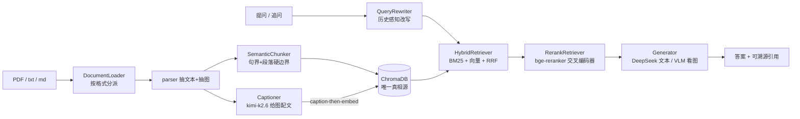

# mm-docqa · 多模态文档问答助手

上传图文混排的文档（**PDF / txt / md**），就内容（**含论文插图、表格**）提问，得到**带引用来源、可点击溯源**的答案，并支持**多轮追问**。

一套围绕「可替换组件」设计的中文 RAG 系统：检索做到 **语义切分 → 混合检索(BM25+向量+RRF) → 交叉编码器重排** 三级递进，并把论文里的图表通过 **caption-then-embed** 纳入同一检索空间，让「困惑度曲线说明了什么」这类问题也能召回到图。

技术栈：Python · FastAPI · Gradio · ChromaDB · sentence-transformers(bge) · DeepSeek / Moonshot(kimi-k2.6)

------

## 核心设计：接口隔离（这是整个项目的承重墙）

`core/interfaces.py` 定义**六个**抽象基类 `DocumentLoader / Chunker / Retriever / Generator / QueryRewriter / Evaluator`，`core/pipeline.py` **只依赖这些接口、不 import 任何具体实现**。换加载格式、换分块策略、换检索器、换大模型、换改写策略，只动 `core/config.py` 的工厂分支，主流程与路由一行不改。从最上游的文档加载到查询改写，每一层都在接口之后、都可插拔。



所有箭头中间的方块都是「可换的供应商」，pipeline 只认接口。

------

## 检索质量（量化，非肉眼判断）

人工标注的 6 题黄金集，逐级对比 `dense → hybrid → rerank`（k=3）：

| 指标      | Dense | Hybrid | Rerank   |
| --------- | ----- | ------ | -------- |
| HitRate@3 | 0.67  | 0.83   | **1.00** |
| Recall@3  | 0.58  | 0.75   | **0.92** |
| MRR       | 0.58  | 0.75   | **0.81** |
| 延迟/查询 | ~10ms | ~8ms   | ~800ms   |

> 诚实说明：黄金集 n=6，单题权重 0.167，结论**方向性可信、统计量偏小**；rerank 在小 k 占优，但更激进的重排会在 Recall@5 上略低于 hybrid（偶把相关块挤出）。评估脚本见 `scripts/eval_*.py`。

**答案质量评估**（`evaluators/answer.py`，兑现同一 `Evaluator` 接口）：在检索评估之外，对最终答案做两个**确定性**指标——

- **CitationPrecision**：答案标注的 `[n]` 引用有几成落在检索范围内（抓「幻觉引用」）。实测 **1.00**，为「带引用来源」这一核心卖点提供确定性证据。
- **AnswerCoverage**：`expected_answer` 关键点的字面命中率（弱信号，不等于正确率）。实测 **0.83**，并真实暴露出「社会网络结论」一题答案覆盖不足——评估用于探测问题，不为刷分。

> 为什么不用 LLM-as-judge：评估优先**可复现**（同输入同输出）才能可信地背书改进，而 LLM 评分非确定；且「用 DeepSeek 生成、再用 DeepSeek 评判」有自评偏袒。LLM-judge 列入 roadmap，未来若引入需独立裁判模型 + 多次采样 + 人工抽检校准。脚本 `scripts/eval_answer.py`。

设计取舍：RRF 融合**只用名次不用原始分**（`score = Σ 1/(60+rank)`），绕开向量 cosine 与 BM25 分数量纲不可比的标定难题；BM25 索引每次从 Chroma 全量重建，保证「Chroma 是唯一真相源」、重启自愈、多次上传不漂移。

------

## 多模态：让图也能被检索

- **抽图**：用 `page.get_image_rects + get_pixmap(clip=rect)` 按页面位置渲染，而非抽原始 xref——避免带翻转矩阵的图被镜像、导致 VLM 读错字；按原生尺寸过滤掉 logo 等噪声。
- **配文入库**：每张图经 kimi-k2.6 生成中文 caption（图类型+维度+关键数值），caption 作为「文本」参与 bge 嵌入，于是图能被语义召回，并在引用来源里标出。
- **工程稳健**：caption 并发受 VLM 账号并发上限约束（实测 429），故并发卡在上限内 + 自动退避重试 + 单图失败跳过不拖垮整篇入库。
- **看图作答（VLM-at-query）**：检索命中图块时把图直接喂回 kimi-k2.6 看图作答，界面以 Gallery 展示命中图；无图块则回退 DeepSeek 纯文本。`VLMGenerator` 继承 `LLMGenerator` 复用引用编号映射——`Generator` 签名不变、pipeline 与路由零改动接入。

------

## 多轮对话：历史感知查询改写（condense question）

追问「那它怎么用？」「第一步展开说说」依赖上文，裸拿去检索会召回垃圾。`QueryRewriter` 在**进入检索之前**用对话历史把追问改写成自洽的独立 query（如「具体怎么做？」→「github 提交的具体步骤」），改写吸收了历史依赖，于是下游 `retrieve / generate` 仍是**无状态单轮**——`pipeline.run(query, k)` 一行不改。多轮是叠在无状态内核之上的编排层，不是侵入内核。

- 历史存于 SQLite `messages` 表（按 `session_id`），服务端持久化；前端 `gr.Chatbot` 仅作展示，`session_id` 对齐两者，「新会话」换 key 即翻篇。
- `LLMRewriter` 首轮（无历史）不调 LLM、改写失败回退原句，绝不拖垮检索；`NoOpRewriter` 为可关闭多轮的零实现。

## 可溯源：引用一键展开看依据

每条引用 `[n]` 在界面上是可点击的折叠块，展开即看到该编号对应的**检索原文**（图块则是 VLM 的中文 caption）——答案凭什么这么说，逐字可核对。原文在检索时已随 `Retrieved` 在手，顺带回传，不额外检索；前端用标准 HTML `<details>` 折叠，零 JS、天然支持多轮。RAG 不黑箱的关键，就是把检索证据端到台前。

------

## 快速开始

```bash
# 1. 依赖
pip install -r requirements.txt

# 2. 配置 key（复制模板后填入自己的 key）
cp .env.example .env
#   DEEPSEEK_API_KEY=...   文本生成
#   MOONSHOT_API_KEY=...   图表 caption / 看图问答

# 3. 起后端（FastAPI，:8000）
python api/main.py

# 4. 另开终端起前端（Gradio）
python app.py
```

首次运行会自动下载 `bge-small-zh-v1.5`（嵌入）与 `bge-reranker-base`（重排）。

------

## 目录结构

```
core/        interfaces(六个ABC) · pipeline(只依赖接口) · config(工厂) · paths
chunkers/    fixed · semantic(句界+段落硬边界)
retrievers/  dense(bge+Chroma) · keyword(BM25) · hybrid(RRF融合) · rerank(交叉编码器)
generators/  template · llm(DeepSeek 开卷+引用编号) · vlm(命中图→kimi 看图作答)
rewriters/   noop(直通) · llm(历史感知改写，多轮)
ingest/      parser(抽文本/抽图/表格) · captioner(VLM 配文 + 图块构建) · loaders(Pdf/Text/Auto 分派)
evaluators/  retrieval(HitRate@k / Recall@k / MRR) · answer(CitationPrecision / AnswerCoverage)
store/       metadata_db(SQLite：文档状态 + 会话历史)
api/         main(共享资源) · routes(异步入库 + 提问 + 删除) · schemas(前后端合同)
app.py       Gradio 界面（多轮对话 + 可溯源 + 命中图）
scripts/     eval_* 评估 · verify_* 各模块独立验证
```

------

## 已知局限 / 路线图

**已知局限（诚实标注）**

- 黄金集 n=6，结论方向性可信但统计量偏小；rerank 在大 k 不严格占优（详见上文检索质量表）。
- PDF 正文与「参考文献」间为单换行无空行，段落硬边界切不开，参考文献污染靠 rerank 压制但未根除。
- 表格抽取做通用行列线性化，合并单元格 / 跨页表 / 嵌套表暂不特殊处理。
- AnswerCoverage 为字面子串匹配的弱信号，不等于正确率（「12 个主题」vs「十二个主题」会漏判）。

**路线图**

- 难表 →「表格区域截图 → VLM 看图作答」，复用现有多模态管线。
- LLM-as-judge 答案评估（需独立裁判模型 + 多次采样 + 人工抽检校准）。
- 鉴权、Web 部署、扩大黄金集（n>6）。