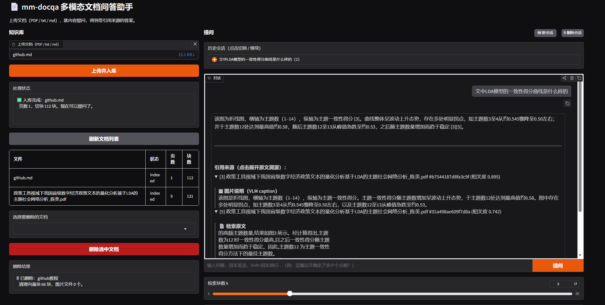
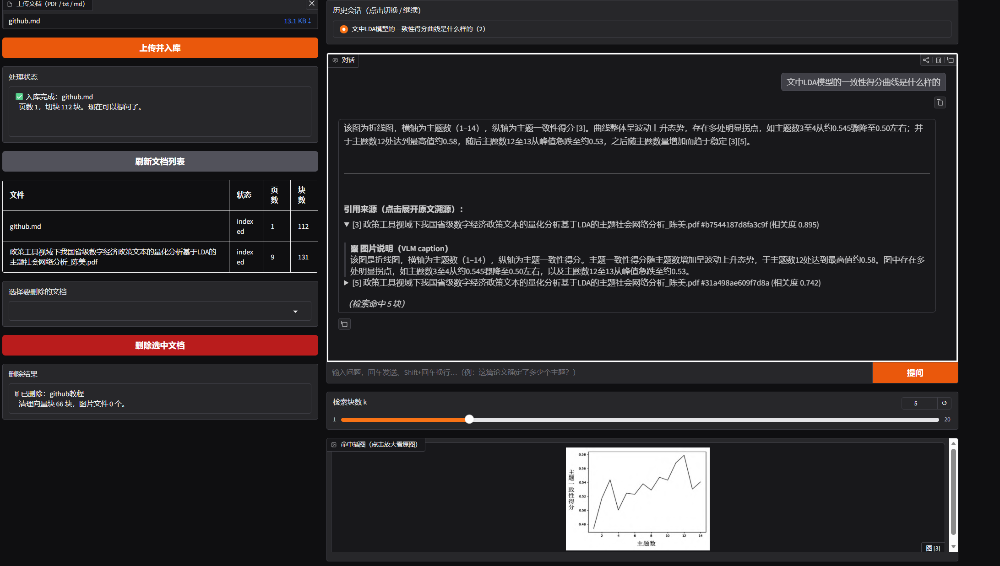
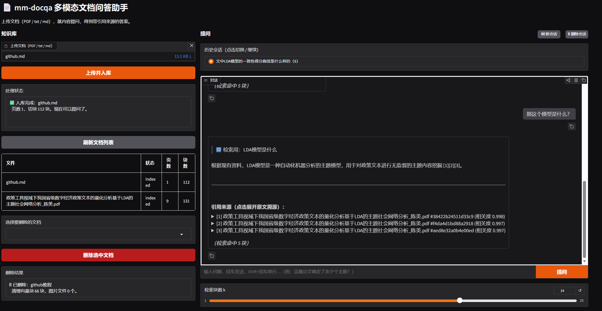
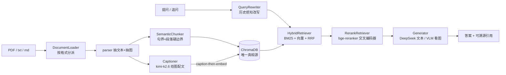

# mm-docqa · 多模态文档问答助手

上传图文混排的文档（**PDF / txt / md**），就内容（**含论文插图、表格**）提问，得到**带引用来源、可点击溯源**的答案，并支持**多轮追问**。

一套围绕「可替换组件」设计的中文 RAG 系统：检索做到 **语义切分 → 混合检索(BM25+向量+RRF) → 可选交叉编码器重排**，并把论文里的图表通过 **caption-then-embed** 纳入同一检索空间，让「困惑度曲线说明了什么」这类问题也能召回到图。整个系统**可度量**：12 题版本化黄金集 + 检索 / 答案 / LLM 裁判 / 人工校准四层评估，改动靠数字背书、缺陷如实标注。

技术栈：Python · FastAPI · Gradio · ChromaDB · sentence-transformers(bge) · DeepSeek / Moonshot(kimi-k2.6)

  

> **一眼结果**(12 题黄金集,本机可复现):检索 Recall@5 **0.58 → 0.79**(hybrid) · 引用零幻觉 CitationPrecision **1.0** · 跨厂商 LLM 裁判 correctness **0.96** · 裁判人工校准 **MAE 0** · 并诚实定位一处检索缺陷。

------

## 项目演示

| 功能                                                         | 界面                                         |
| ------------------------------------------------------------ | -------------------------------------------- |
| **核心问答 + 可溯源引用**<br>上传文档→提问→答案带 `[n]` 引用,点开折叠块即见检索原文 |                |
| **多模态:图表也能被检索**<br>问图表相关问题,命中图以 Gallery 展示、VLM 看图作答 |              |
| **多轮追问**<br>依赖上文的追问经历史感知改写后仍正确召回     |  |

------

## 核心设计：接口隔离（这是整个项目的承重墙）

`core/interfaces.py` 定义**六个**抽象基类 `DocumentLoader / Chunker / Retriever / Generator / QueryRewriter / Evaluator`，`core/pipeline.py` **只依赖这些接口、不 import 任何具体实现**。换加载格式、换分块策略、换检索器、换大模型、换改写策略，只动 `core/config.py` 的工厂分支，主流程与路由一行不改。从最上游的文档加载到查询改写，每一层都在接口之后、都可插拔——每个接口背后都有 ≥2 个可换实现（如 `dense/keyword/hybrid/rerank` 四种检索器），这正是「可替换」不是口号的证据。



所有箭头中间的方块都是「可换的供应商」，pipeline 只认接口。

------

## 检索质量（量化，非肉眼判断）

12 题人工标注黄金集（`evaluators/golden.jsonl`，单一真相源，可版本化 / diff / 非代码编辑），逐级对比 `dense → hybrid → rerank`（top-5）：

| 指标      | Dense | Hybrid   | Rerank |
| --------- | ----- | -------- | ------ |
| HitRate@5 | 0.67  | **0.92** | 0.92   |
| Recall@5  | 0.58  | **0.79** | 0.79   |
| MRR       | 0.52  | **0.74** | 0.72   |
| 延迟/查询 | ~6ms  | ~8ms     | ~885ms |

**怎么读这张表**：hybrid 把 dense 漏掉的查询用 BM25 词面通道救回——「研究方法 / 43 份 / 24 省份」这类含**精确术语或数字**的问题，纯向量会糊掉，hybrid 把它们从 top-5 外拽回 rank 1（dense `-` → hybrid 1）。而 **rerank 在这 12 题事实查询上并不优于 hybrid**：k=3 时 Recall 反低（0.667 vs 0.708）、k=5 时持平且 MRR 略降，却贵约 **100×**。cross-encoder 重排的价值在「首阶召回噪声大、候选需精排」时才显现，本评估集（小、词面清晰）未触发该场景——**这是真实测量结果，不为给 rerank 背书而修饰**。生产配置仍挂 rerank（对更大 / 更噪语料留余量），但这张表诚实地说明：在当前数据上 hybrid 才是性价比甜点。

> 黄金集 n=12，单题权重 0.083，结论方向性可信、统计量仍偏小。评估脚本 `scripts/eval_run.py`（dense vs hybrid）、`scripts/eval_rerank.py`（三档 + 延迟）。

**找到并刻画了一个检索缺陷**：查询「社会网络分析得出了什么结论」在 dense 与 hybrid 下**双双 miss**，且 n=6、n=12 两次一致——结论段落讲「节点 / 贡献度 / 治理」却不含「结论」二字，抽象问法与具体发现间既无词面锚、又有语义鸿沟。这一缺陷被**三个独立指标交叉印证**：检索 Recall miss、答案 AnswerCoverage 漏关键点、LLM-judge correctness 低**而** groundedness 满（「有据但答错」——答案忠于检索到的内容，但检索取错了段落）。下一步杠杆：查询改写注入领域词 / 章节感知召回。**评估用于探测问题，不为刷分。**

------

## 答案质量评估（确定性 → LLM 判 → 人工校准，逐层加强）

12 题、生产配置 `rerank+semantic+llm`，对最终答案三层评估：

**① 确定性指标**（`evaluators/answer.py`，免费、可复现、常驻）

- **CitationPrecision = 1.0**：答案标注的 `[n]` 引用**全部**落在检索范围内（零幻觉引用），为「带引用来源」核心卖点提供确定性证据。
- **AnswerCoverage = 0.92**：`expected_answer` 关键点的字面命中率（弱信号，不等于正确率），唯一漏点正是上述「社会网络结论」缺陷题。

**② LLM-as-judge**（`evaluators/judge.py`，opt-in `RUN_JUDGE=1`）

- **跨厂商裁判**：答案由 DeepSeek 生成、裁判换 Moonshot **kimi-k2.6**，杜绝「运动员兼裁判」的自评偏袒。
- **多采样 + 报告方差**：每题采样取均值，并产出 `JudgeStability`（采样方差→判得稳不稳本身做成可读信号）。
- **失败不静默虚高**：单次调用 / 解析失败跳过该次采样不崩；某题全失败计入 `n_failed`，**绝不当满分**。
- 实测：**Correctness 0.96 / Groundedness 1.0 / Stability 1.0 / n_failed 0**。

**③ 人工校准**（`scripts/eval_calibrate.py`）

没校准过的 judge 分不可信、不许对外引用。对 12 题各打人工 correctness 分与裁判比对，得 **MAE = 0 / ExactMatch = 1.0（n=12）**——裁判与人工在这批 QA 上零误差一致。

> 诚实边界：MAE=0 一半是裁判靠谱、一半是本评估集多为无歧义事实题、人机本就易一致。准确表述是「**事实型 QA 上零误差一致**」，而非「裁判万能」；更难 / 更主观的题上 Stability 与一致率都会下降。

设计取舍：RRF 融合**只用名次不用原始分**（`score = Σ 1/(60+rank)`），绕开向量 cosine 与 BM25 分数量纲不可比的标定难题；BM25 索引每次从 Chroma 全量重建，保证「Chroma 是唯一真相源」、重启自愈、多次上传不漂移。

------

## 多模态：让图也能被检索

- **抽图**：用 `page.get_image_rects + get_pixmap(clip=rect)` 按页面位置渲染，而非抽原始 xref——避免带翻转矩阵的图被镜像、导致 VLM 读错字；按原生尺寸过滤掉 logo 等噪声。
- **配文入库**：每张图经 kimi-k2.6 生成中文 caption（图类型+维度+关键数值），caption 作为「文本」参与 bge 嵌入，于是图能被语义召回，并在引用来源里标出。
- **工程稳健**：caption 并发受 VLM 账号并发上限约束（实测 429），故并发卡在上限内 + 自动退避重试 + 单图失败跳过不拖垮整篇入库。
- **看图作答（VLM-at-query）**：检索命中图块时把图直接喂回 kimi-k2.6 看图作答，界面以 Gallery 展示命中图；无图块则回退 DeepSeek 纯文本。`VLMGenerator` 继承 `LLMGenerator` 复用引用编号映射——`Generator` 签名不变、pipeline 与路由零改动接入。

------

## 多轮对话：历史感知查询改写（condense question）

追问「那它怎么用？」「第一步展开说说」依赖上文，裸拿去检索会召回垃圾。`QueryRewriter` 在**进入检索之前**用对话历史把追问改写成自洽的独立 query（如「具体怎么做？」→「github 提交的具体步骤」），改写吸收了历史依赖，于是下游 `retrieve / generate` 仍是**无状态单轮**——`pipeline.run(query, k)` 一行不改。多轮是叠在无状态内核之上的编排层，不是侵入内核。

- 历史存于 SQLite `messages` 表（按 `session_id`），服务端持久化；前端 `gr.Chatbot` 仅作展示，`session_id` 对齐两者，「新会话」换 key 即翻篇。
- `LLMRewriter` 首轮（无历史）不调 LLM、改写失败回退原句，绝不拖垮检索；`NoOpRewriter` 为可关闭多轮的零实现。

## 可溯源：引用一键展开看依据

每条引用 `[n]` 在界面上是可点击的折叠块，展开即看到该编号对应的**检索原文**（图块则是 VLM 的中文 caption）——答案凭什么这么说，逐字可核对。原文在检索时已随 `Retrieved` 在手，顺带回传，不额外检索；前端用标准 HTML `<details>` 折叠，零 JS、天然支持多轮。RAG 不黑箱的关键，就是把检索证据端到台前。

------

## 快速开始

```bash
# 1. 依赖
pip install -r requirements.txt

# 2. 配置 key（复制模板后填入自己的 key）
cp env.example .env
#   DEEPSEEK_API_KEY=...   文本生成
#   MOONSHOT_API_KEY=...   图表 caption / 看图问答

# 3. 起后端（FastAPI，:8000）
python api/main.py

# 4. 另开终端起前端（Gradio）
python app.py
```

首次运行会自动下载 `bge-small-zh-v1.5`（嵌入）与 `bge-reranker-base`（重排）。

**复现评估**（黄金集已随仓提供）：

```bash
python scripts/eval_run.py            # 检索：dense vs hybrid（免费）
python scripts/eval_rerank.py         # 检索：三档对比 + 延迟（免费）
RUN_JUDGE=1 python scripts/eval_answer.py   # 答案：确定性指标 + LLM 裁判
python scripts/eval_calibrate.py      # 裁判人工校准（MAE / 一致率）
```

------

## 目录结构

```
core/        interfaces(六个ABC) · pipeline(只依赖接口) · config(工厂) · paths
chunkers/    fixed · semantic(句界+段落硬边界)
retrievers/  dense(bge+Chroma) · keyword(BM25) · hybrid(RRF融合) · rerank(交叉编码器)
generators/  template · llm(DeepSeek 开卷+引用编号) · vlm(命中图→kimi 看图作答)
rewriters/   noop(直通) · llm(历史感知改写，多轮)
ingest/      parser(抽文本/抽图/表格) · captioner(VLM 配文 + 图块构建) · loaders(Pdf/Text/Auto 分派)
evaluators/  retrieval(HitRate@k/Recall@k/MRR) · answer(CitationPrecision/AnswerCoverage)
             judge(跨厂商 LLM 裁判+多采样+校准) · golden.jsonl(12题黄金集，单一真相源)
store/       metadata_db(SQLite：文档状态 + 会话历史)
api/         main(共享资源) · routes(异步入库 + 提问 + 删除) · schemas(前后端合同)
app.py       Gradio 界面（多轮对话 + 可溯源 + 命中图）
scripts/     eval_*(run/rerank/answer/label/calibrate 评估) · verify_*(各模块独立验证)
```

------

## 已知局限 / 路线图

**已知局限（诚实标注）**

- 黄金集 n=12，结论方向性可信但统计量仍偏小；评估集多为无歧义事实题，judge Stability=1.0 / 校准 MAE=0 部分源于此，更难的题上一致度会下降。
- 「结论型查询召不回结论段」为已刻画的检索缺陷（dense+hybrid 双 miss，三指标交叉印证），尚未修复，下一步为查询改写 / 章节感知召回。
- PDF 正文与「参考文献」间为单换行无空行，段落硬边界切不开，参考文献污染靠 rerank 压制但未根除。
- 表格抽取做通用行列线性化，合并单元格 / 跨页表 / 嵌套表暂不特殊处理（二维结构在嵌入前丢失）。
- AnswerCoverage 为字面子串匹配的弱信号，不等于正确率（「12 个主题」vs「十二个主题」会漏判）——故引入 LLM-judge 补语义盲区。

**路线图**

- **难表 →「表格区域截图 → VLM 看图作答」**：复用现有多模态管线（一张表格截图 = 又一个 figure dict，走 `build_image_chunks` → 自动成 image 块 → VLM 零改动看图），架构判断已定、待实现。
- 修「结论型查询」检索缺陷：查询改写注入领域词 / 章节感知召回，用现有 eval 度量 delta。
- 鉴权、Web 部署。